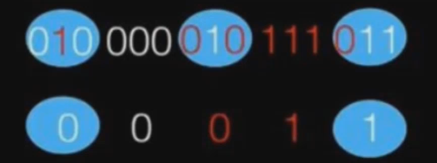

# Телеком

## Лекция 17.02

### Основные мысли

* Векторное пространство, базис $\{\sin(x), \cos(x), \sin(2x), \cos(2x), ...\}$
* Если функция _периодическая_, имеет конечное количество точек _строгого_ экстремума и точек разрыва (причем только _первого_ рода), то для нее существует ряд Фурье

Для функций с периодом $2\pi$:
$$
\begin{aligned}
	\frac{f(t-0) + f(t+0)}{2} = f^$(t) &= \frac{a_0}{2} + \sum_{n=1}^\infty (a_n\cdot \cos(nt) + b_n\cdot \cos(nt)) \\
	a_0 &= \frac{1}{\pi} \int_{-\pi}^\pi f(t)dt \\
	a_n &= \frac{1}{\pi} \int_{-\pi}^\pi f(t)\cos(nt)dt \\
	b_n &= \frac{1}{\pi} \int_{-\pi}^\pi f(t)\sin(nt)dt
\end{aligned}
$$
Комплексная форма:
$$
\begin{aligned}
	f^$(t) &= \sum_{n=-\infty}^\infty C_n e^{i2\pi fnt} \\
	C_n
		&= \frac{1}{2\pi} f(t) \overline{\phi_n(t)} \\
		&= \frac{1}{2\pi} \int_{-\pi}^\pi f(t)e^{-i2\pi fnt}dt
\end{aligned}
$$
Тут $\pi$ можно заменить на любой другой полупериод.

Минус в $e^{-2\pi fnt}$ из-за того, что тут скалярное произведение комплексных чисел: $\left<f(t), e^{2\pi fnt}\right>$, а для комплексных чисел это умножение на комплексно-сопряженное.

* **Если сигнал периодический, то спектр дискретный:** Потому что это просто сумма некоторых компонент вида $C_n e^{2\pi fnt}$. Поэтому же и обратное верно.

* **Теорема Котельникова:** Любую функцию, состоящую из частот $0 < f < f_{max}$ можно непрерывно представить с любой точностью при помощи чисел, следующих друг за другом не менее, чем через $\frac{1}{2f_{max}}$ секунд. При этом, функция "восстанавливается" при помощи сложения "горок" вида $sinc$.

$$
f^$(t)=\sum_{-\infty}^\infty f(-n\Delta t) sinc(\omega_{max}(t-n\Delta t))
$$

* Если сигнал _непериодический_, то это как если бы $T\rightarrow\infty$

$$
\begin{aligned}
	f^$(t)
		&= \lim_{T\rightarrow\infty} \left( \sum_{n=-\infty}^\infty C_n e^{i2\pi fnt} \right) \\
		&= \lim_{T\rightarrow\infty} \left( \sum_{n=-\infty}^\infty \left[ \frac{1}{T} \int_t^{t + T} f(t) e^{-2\pi fnt} dt \right] e^{i2\pi fnt} \right) \\
		&// \frac{1}{T}\rightarrow df \\
		&= \int_{-\infty}^\infty \left[ \int_{-\infty}^\infty f(t) e^{-2\pi fnt} dt \right] e^{i2\pi fnt} df \\
\end{aligned}
$$

Пусть "все хорошо", и дальше $f^\$(t) = f(t)$.

Отсюда же видно, что сумма стала интегралом, поэтому спектр _непериодического_ сигнала _не дискретный_.

По итогу, вот это называется _прямым_ преобразованием Фурье:
$$
F(f) = \int_{-\infty}^\infty f(t) e^{-2\pi fnt} dt
$$
А вот это - _обратным_:
$$
f(t) = \int_{-\infty}^\infty F(f) e^{2\pi fnt} df
$$

* **Если спектр периодический, то сигнал дискретный:** Рассмотрим ограниченный спектр из $\pm\omega$, продолжим его периодически в бесконечность и разложим в ряд Фурье. Тогда коэффициенты $C_n$ можно вычислить по дискретным отсчетам времени с шагом в соответствии с $\frac{\pi}{\omega}$. Обратное тоже верно.
* У $sinc$'а преобразование Фурье имеет вид прямоугольника

## Лекция 03.03

### Основные мысли

* $sinc$ во времени - это идеальный фильтр, потому что в частотной области это просто прямоугольник
* В предельном случае $sinc$ "превращается" в $\delta$-импульс:

$$
\begin{aligned}
	\delta_{x}(t) &=
        \begin{cases}
            \infty, &\text{если }t=x\\
            0, &\text{иначе}
        \end{cases} \\
    1 &= \int_{-\infty}^\infty \delta_x(t)dt
\end{aligned}
$$

* Свертка - это что-то вроде линейной комбинации каждой точки одной функции с каждой точкой другой с заданным сдвигом

Пусть есть периодический сигнал $x(t)$ с периодом $T$. Для него существует ряд Фурье:
$$
\begin{aligned}
	x(t) &= \sum_{k=-\infty}^\infty C_k e^{i2\pi \frac{1}{T} kt}
\end{aligned}
$$
Проведем его дискретизацию так, чтобы в $T$ было $N$ отсчетов:
$$
\begin{aligned}
	t_n &= \frac{n}{N}T \\
	x_n
		&= \sum_{k=-\infty}^\infty C_k e^{i2\pi \frac{1}{T} kt_n} \\
		&= \sum_{k=-\infty}^\infty C_k e^{i2\pi \frac{1}{T} k \frac{n} {N}T} \\
        &= \sum_{k=-\infty}^\infty C_k e^{i2\pi k \frac{n} {N}} \\
\end{aligned}
$$
Так как $e^{i\phi}$ периодична, все $C_k$, которые соответствуют одному и тому же углу поворота, можно собрать в кучу в один $X_k$:
$$
\begin{aligned}
	x_n &= \sum_{k=0}^{N-1} X_k e^{i2\pi k \frac{n} {N}} \\
	X_k &= \sum_{l=-\infty}^\infty C_{k+lN} \\
\end{aligned}
$$
Но $X_k$ тут все равно требуют бесконечных сумм. Если умножить $x_n$ на $e^{-i\frac{2\pi}{N}mn}$ ($m$ - просто "какая-то там" переменная) и просуммировать, а затем проделать математические манипуляции, то получим:
$$
\begin{aligned}
	\sum_{n=0}^{N-1} x_n e^{-i\frac{2\pi}{N}mn}
    	&= \sum_{k=0}^{N-1} X_k N\delta_{km} \\
    	&= X_m N \\
    \frac{1}{N} \sum_{n=0}^{N-1} x_n e^{-i\frac{2\pi}{N}mn} &= X_m \\
    &\Updownarrow \\
    \frac{1}{N} \sum_{n=0}^{N-1} x_n e^{-i\frac{2\pi}{N}kn} &= X_k
\end{aligned}
$$
Таким образом, мы можем из дискретных значений исходного сигнала при помощи умножения на комплексные синусоиды получать некоторые коэффициенты, из которых таким же умножением на комплексные синусоиды мы можем восстановить обратно дискретные значения сигнала:
$$
\begin{aligned}
    X_k &= \frac{1}{N} \sum_{n=0}^{N-1} x_n e^{-i\frac{2\pi}{N}kn} \\
    x_n &= \sum_{k=0}^{N-1} X_k e^{i\frac{2\pi}{N}kn}
\end{aligned}
$$
Это называется _дискретным_ преобразованием Фурье.

* ДПФ можно сделать в виде матрицы:

$$
\hat{A} =
	\begin{pmatrix}
		1 & 1 & 1 & ... & 1 \\
		1 & e^{-i\frac{2\pi}{N}} & e^{-i\frac{4\pi}{N}} & ... & e^{-i\frac{2\pi}{N}(N-1)} \\
		1 & e^{-i\frac{4\pi}{N}} & e^{-i\frac{8\pi}{N}} & ... & e^{-i\frac{2\pi}{N}2(N-1)} \\
		1 & e^{-i\frac{6\pi}{N}} & e^{-i\frac{12\pi}{N}} & ... & e^{-i\frac{2\pi}{N}3(N-1)} \\
		... & ... & ... & ... & ... \\
		1 & e^{-i\frac{2\pi}{N}(N-1)} & e^{-i\frac{2\pi}{N}2(N-1)} & ... & e^{-i\frac{2\pi}{N}(N-1)^2} \\
	\end{pmatrix}
$$

$$
\vec{X} = \hat{A}\vec{x}
$$

* Линейная стационарная система:

$$
\begin{aligned}
	H\{\alpha x_1[n] + \beta x_2[n]\} &= \alpha H\{x_1[n]\} \beta H\{x_2[n]\} \\
	y[n] = H\{x[n]\} &\Rightarrow y[n-k] = H\{x[n-k]\}
\end{aligned}
$$

* Импульсную характеристику системы можно видеть по ее реакции на $\delta$-импульс:

$$
h[n] = H\{\delta[n]\}
$$

* Дискретный сигнал - это линейная комбинация $\delta$-импульсов (семейство $\delta$-импульсов, каждый из которых произошел в свой момент времени)
* Смысл системы в том, что она берет входной сигнал и выдает его линейную комбинацию. Коэффициенты и определяются импульсной характеристикой системы, другими словами:

$$
y[n] = \sum_k x[k]h[n - k] = (x \star h)[n]
$$

Ну то есть, линейная комбинация - это по сути вот такая _дискретная свертка_ ($\star$ вместо $*$).

* Система выполняет свертку сигнала во времени со своей импульсной характеристикой, что означает, что в частотном пространстве происходит произведение спектра входного сигнала на спектр импульсной характеристики (там есть теорема об этом)

* "Нейтральная система", которая не меняет входной сигнал - это такая, у которой импульсная характеристика - это просто $\delta$-импульс у начале координат. Тогда свертка входного $x[n]$ с ним останется тем же $x[n]$
  * Можно сказать, что мы берем линейную комбинацию входного сигнала в виде одного слагаемого с коэффициентом 1 и получаем это же на выходе
  * Либо можно сказать, что в частотной области происходит умножение всего спектра входного сигнала на константу 1, что его никак не меняет
* Если у системы хитрая импульсная характеристика, то мы можем на вход подать одиночный $\delta$-импульс: тогда после свертки мы в результате увидим саму "примесь", внесенную системой
  * Мы как бы берем линейную комбинацию самой импульсной характеристики системы в виде одного слагаемого с коэффициентом 1 и наблюдаем это на выходе
  * Либо, аналогично, спектр входного сигнала тут - это константа 1, что никак не меняет спектр импульсной характеристики, что мы и видим на выходе
* Системы могут иметь:
  * **К**онечную **И**мпульсную **Х**арактеристику (**F**inite **I**mpulse **R**esponse)
  * **Б**есконечную **И**мпульсную **Х**арактеристику
* Или быть [не]каузальными. _Каузальные_ - сигнал на выходе не может появиться раньше, чем он пришел на вход и прошел через систему

## Лекция 17.03

### Основные мысли

* КИХ - всегда устойчивы, БИХ м. б. неустойчивы
* КИХ-фильтр порядка $N$ содержит $N+1$ коэффициент

* У БИХ-фильтров должно было бы быть бесконечно много коэффициентов, но практике их реализуют при помощи обратных связей

_Прямая_ форма:

Или такая:

Или _каноническая_:

* БИХ-фильтры имеют отрицательные обратные связи, поэтому их время установления потенциально бесконечно
* Из-за возможных положительных обратных связей БИХ-фильтры _неустойчивы_, поэтому есть ограничения на входной сигнал $x[n]$
* $e^{i\omega n}$ - собственная последовательность линейной стационарной системы, потому что она проходит систему без изменений (ни усиления, ни фазового сдвига):

$$
\begin{aligned}
	y[n]
		&= e^{i\omega n}\star h[n] \\
		&= h[n]\star e^{i\omega n} \\
		&= \sum_{k=-\infty}^\infty h[k] e^{i\omega (n-k)} \\
		&= e^{i\omega n} \sum_{k=-\infty}^\infty h[k] e^{-i\omega k} \\
		&= e^{i\omega n} H(\omega) \\
		&= e^{i\omega n} DTFT\ h \\
\end{aligned}
$$

Поэтому если мы раскладываем входное воздействие по комплексным экспонентам, влияние системы можно удобно записать как умножение на импульсную характеристику.

На лекции мы $H(\omega)$ обозначили как $H(e^{i\omega n})$.

_Раньше мы подавали на вход только сигналы вида $\mathbb{R}\rightarrow\mathbb{R}$, а тут входной сигнал $\mathbb{R}\rightarrow\mathbb{C}$, поэтому при свертке получается такой несколько неожиданный результат._

* Частотная характеристика фильтра - результат преобразования Фурье от импульсной характеристики
* По виду **А**мплитудно-**Ч**астотной **Х**арактеристики $|H(\omega)|$:
  * **Ф**ильтр **Н**ижних **Ч**астот
  * **Ф**ильтр **В**ерхних **Ч**астот
  * **П**олосно-**П**ропускной **Ф**ильтр
  * **П**олосно-**З**аграждающий **Ф**ильтр
* По виду **Ф**азово-**Ч**астотной **Х**арактеристики $\phi[n] = \omega n+\Theta$:
  * С линейной фазой
  * С нелинейной фазой
* ФВЧ, ППФ и ВЗФ можно рассматривать как сдвиги и растяжения-сжатия ФНЧ, потому что сигнал _дискретный_ (его спектр _периодический_) и по краям соседние повторяющиеся картины "склеиваются". ФВЧ, например, - горки вокруг [частоты Найквиста](https://ru.wikipedia.org/wiki/%D0%A7%D0%B0%D1%81%D1%82%D0%BE%D1%82%D0%B0_%D0%9D%D0%B0%D0%B9%D0%BA%D0%B2%D0%B8%D1%81%D1%82%D0%B0) (полупериод в частотах)

$$
\begin{aligned}
	H_{lp}(\omega) &=
		\begin{cases}
			1, &-\omega_c < \omega < \omega_c \\
			0, &\text{иначе}
		\end{cases} \\

	h_{lp}[n] &= \frac{\omega_c}{\pi} sinc\left(\frac{\omega_c}{\pi}\right) \\
	H_{hp}(\omega) &= 1 - H_{lp}(\omega) \\
	h_{hp}[n] &= \delta[n] - \frac{\omega_c}{\pi} sinc\left(\frac{\omega_c}{\pi}\right) \\
\end{aligned}
$$

* Умножение сигнала на гармоническую функцию вызывает сдвиг его преобразования Фурье на некоторую частоту:

$$
\begin{aligned}
	h_{bp}[n]
		&= 2\cos(\omega_0 n) \frac{\omega_c}{\pi} sinc\left(\frac{\omega_c}{\pi}\right) \\
		&= \left( e^{i\omega_0 n} + e^{-i\omega_0 n} \right) \frac{\omega_c}{\pi} sinc\left(\frac{\omega_c}{\pi}\right) \\
	&\Downarrow \\
	H_{bp}(\omega) &=
		\begin{cases}
			1, &-\omega_c < \omega \pm \omega_0< \omega_c \\
			0, &\text{иначе}
		\end{cases} \\
\end{aligned}
$$

Насколько я понимаю, тут мы получим сумму двух спектров-прямоугольников: один уедет влево на $\omega_0$, а второй - вправо, поэтому я написал выше $\pm$.

Почему он вообще куда-то поедет? Потому что у преобразования Фурье есть такое свойство, что сдвиг аргумента прообраза соответствует умножению образа на комплексную экспоненту.

* Модуляция: $y[n] = x[n]cos(\omega_0 n)$
* Демодуляция: $x[n] = y[n]cos(\omega_0 n)$
* Простейшая _однотональная_ модуляция полезного сигнала $s(t) = A_s cos(\Omega t)$: $U(t) = (O_u+S_u s(t))cos(\omega_0 t)$, где $O_u$ - сдвиг вверх, а $S_u$ - масштаб, чтобы гребни полезного сигнала всегда были выше нуля:

$$
\begin{aligned}
	U(t)
		&= (O_u+S_u A_s cos(\Omega t))cos(\omega_0 t) \\
		&= O_u cos(\omega_0 t) + S_u A_s cos(\Omega t)cos(\omega_0 t) \\
		&= O_u cos(\omega_0 t) + \frac{S_u A_s}{2} cos([\Omega - \omega_0]t) + \frac{S_u A_s}{2} cos([\Omega + \omega_0]t) \\
\end{aligned}
$$

* _Многотональная_ амплитудная модуляция - это модуляция сигнала, который есть сумма разных частот:

$$
\begin{aligned}
	U(t)
		&= (O_u+S_u A_s \sum_{i=0}^{N-1} cos(\Omega_i t))cos(\omega_0 t) \\
		&= O_u cos(\omega_0 t) + \dots + \frac{S_u A_s}{2} cos([\Omega_i - \omega_0]t) + \frac{S_u A_s}{2} cos([\Omega_i + \omega_0]t) + \dots \\
\end{aligned}
$$

* Проблема: большая часть энергии приходится на несущую частоту в 30 кГц, поэтому КПД низкий.

* _Балансная_ модуляция (_Suppressed Carrier_, подавленная несущая) - то же самое, но только без смещения. Тогда неинформативный пик не появляется, да, но на приемнике возникают сложности (не можем умножить на несущую при демодуляции).
* _Однополосная_ модуляция - убираем один из пиков, которые на $\pm\omega_0$, все равно они одинаковые

$$
U(t) = O_u cos(\omega_0 t) + \frac{S_u A_s}{2} cos([\Omega \pm \omega_0]t)
$$

## Лекция 31.03

### Основные мысли

* Опорный сигнал часто называется _пилотом_
* Амплитудная модуляция - амплитуда несущего сигнала меняется по закону низкой частоты
* _Фазовая_ и _частотная_ модуляция различаются лишь в формальном математическом описании, а физически они выглядят одинаково

При _фазовой_ фаза меняется как:
$$
\begin{aligned}
	\phi(t) &= \omega_0 t + ks(t) + \phi_0 \\
	\omega(t) &= \omega_0 + k\frac{d}{dt}s(t) \\
\end{aligned}
$$

При _частотной_ - как:
$$
\begin{aligned}
	\phi(t) &= \omega_0 t + k\int_0^t s(t)dt + \phi_0\\
	\omega(t) &= \omega_0 + ks(t) \\
\end{aligned}
$$

* Индекс модуляции: $\beta = \frac{\omega_d}{\Omega}$, $\omega_d$ - _девиация_ частоты, максимальное отклонение $\omega$ от $\omega_0$

На лекции было написано, что мол $\omega_d = const$ для ЧМ, а для ФМ $\beta = const$, однако $\beta$ и $\omega_d$ пропорциональны, так что это странно (особенно учитывая, что физически это _один и тот же_ сигнал). Подробнее:

Для ФМ:
$$
\begin{aligned}
	\omega_d
		&= max\{\omega(t) - \omega_0\} \\
		&= max\left\{k\frac{d}{dt}s(t)\right\} \\
		&= k\Omega \\
	\beta &= \frac{k\Omega}{\Omega} = k
\end{aligned}
$$

Для ЧМ:
$$
\begin{aligned}
	\omega_d
		&= max\{\omega(t) - \omega_0\} \\
		&= max\{ks(t)\} \\
		&= k\Omega \\
	\beta &= \frac{k\Omega}{\Omega} = k
\end{aligned}
$$

* ФМ (фазовая модуляция) = PM (phase modulation)
* ЧМ (частотная модуляция) = FM (frequency modulation)
* Детектор АМ-сигнала - просто умножение на $\cos$:

$$
\begin{aligned}
	U(t)
		&= (O_u+S_u A_s \cos(\Omega t))\cos(\omega_0 t)\cos(\omega_0 t) \\
		&= (O_u+S_u A_s \cos(\Omega t))[\cos(\omega_0 t)]^2 \\
		&= (O_u+S_u A_s \cos(\Omega t))\frac{1+\cos(2\omega_0 t)}{2} \\
		&= (O_u+S_u A_s \cos(\Omega t))\left[\frac{1}{2} + \frac{\cos(2\omega_0 t)}{2}\right] \\
		&= \frac{O_u}{2} + \frac{S_u A_s}{2}\cos(\Omega t) + \frac{O_u}{2}\cos(2\omega_0 t) + \frac{S_u A_s}{2}\cos(\Omega t)\cos(2\omega_0 t) \\
		&= \frac{O_u}{2} + \frac{S_u A_s}{2}\cos(\Omega t) + \frac{O_u}{2}\cos(2\omega_0 t) + \frac{S_u A_s}{4}\left(\cos((\Omega + 2\omega_0) t) + \cos((\Omega - 2\omega_0) t)\right) \\
\end{aligned}
$$

На лекции на слайде в этой формуле отсутствовал коэффициент $\frac{1}{2}$ в последних слагаемых. Скорее всего, это ошибка на слайде, потому что выше я ошибок не замечаю.

* $Re\{...\} = \Re\{...\}$, $Im\{...\} = \Im\{...\}$

* _Аналитический_ сигнал $z(t)$ - такой, для которого наш принятый есть $s(t) = Re\{z(t)\}$.

Наш принятый $s(t)$ - может быть выражен через его спектр $S(t)$ как:
$$
s(t)
	= \frac{1}{2\pi} \int_{-\infty}^0 S(\omega)e^{i\omega t}d\omega
	+ \frac{1}{2\pi} \int_0^{\infty} S(\omega)e^{i\omega t}d\omega
$$
Тогда его аналитический сигнал - это:
$$
z(t)
	= \frac{1}{\pi} \int_0^{\infty} S(\omega)e^{i\omega t}d\omega = Re\{z(t)\} + iIm\{z(t)\}
$$
При том:
$$
\begin{aligned}
	\overline{z(t)} &= \frac{1}{\pi} \int_{-\infty}^0 S(\omega)e^{i\omega t}d\omega = Re\{z(t)\} - iIm\{z(t)\} \\
	s(t) &= \frac{z(t) + \overline{z(t)}}{2} = Re\{z(t)\}
\end{aligned}
$$

* Оператор Гильберта (_фазовращатель_) - такая система, импульсная характеристика которой имеет вид $hb(t) = \frac{1}{\pi t}$

Тогда свертка с ним имеет вид (_преобразование_ Гильберта):
$$
\mathbb{H}\{s(t)\} = \frac{1}{\pi} \int_{-\infty}^\infty \frac{s(n)}{t - n} dn
$$

* Аналитический сигнал можно получить из принятого $s(t)$ и применения к нему оператора Гильберта: $z(t) = s(t) + i\mathbb{H}\{s(t)\}$
* Преобразование Гильберта разворачивает фазу всех компонентов сигнала на $\frac{\pi}{2}$

Например,
$$
\mathbb{H}\{\cos(\omega_0 t)\} = \sin(\omega_0 t)
$$

* Если $s(t)$ - принятый сигнал, $u(t)$ - аналитический сигнал, а $\phi(t) = \arg(u(t))$ - его фаза, то:
  * АМ-демодуляция:  $s'(t) = s(t)\cos(\omega_0 t)$
  * ФМ-демодуляция: $\phi'(t) = \phi(t) - \omega_0 t$
  * ЧМ-демодуляция: $\omega'(t) = \frac{d}{dt}\phi(t) - \omega_0$
* На лекции еще говорили о _получении аналитического сигнала в реальном масштабе времени_, но тут мне не очень ясно

На слайде было написано:
$$
\begin{aligned}
	u_1(t) &= u(t)\cos(\omega_0 t) =^* \frac{U_m}{2}\cos(\phi(t)) + \frac{U_m}{2}\cos(2\omega_0 t) \\
	u_2(t) &= u(t)\sin(\omega_0 t) =^* \frac{U_m}{2}\sin(\phi(t)) + \frac{U_m}{2}\sin(2\omega_0 t) \\
	u_a(t) &= \frac{U_m}{2}\cos(\phi(t)) - i\frac{U_m}{2}\sin(\phi(t))
\end{aligned}
$$
Мои изначальные мысли:

>  Но почему, например, перед $i$ минус? После применения оператора Гильберта к косинусу должен быть синус без минуса, как мы сказали ранее, да и компонента с $i\mathbb{H}\{...\}$ должна бы входить в $z(t)=u_a(t)$ без минуса.

> Откуда мы получаем эти выражения справа от $=^*$? Мы рассматривали уже, что происходит при умножении полученного сигнала на косинус, и там было слагаемое $\frac{O_u=U_m}{2}\cos(2\omega_0 t)$, только кроме него там было много других штук, и их нельзя свернуть в один простой $\frac{U_m}{2}\cos(\phi(t))$.

Но, возможно, я просто не понимаю, как работает _квадратурная_ (_амплитудно-фазовая_) модуляция...

* Демодуляция при помощи фазовой автоподстройки частоты
  * Контур захвата фазы - **P**hase **L**ock **L**oop
    * **Ф**азо**д**етектор
    * **Ф**ильтр **Н**ижних **Ч**астот
    * **Г**енератор, **У**правляемый **Н**апряжением

* Гетеродинный приемник сначала подменяет несущую частоту сигнала на какую-то промежуточную, с которой потом производится демодуляция

* Супергетеродинный приемник: 2 стадии преобразования частоты в промежуточную

## Лекция 14.04

### Основные мысли

* Четырехугольник телекоммуникационных технологий (_Телекоммуникационное одеяло_)

* Формула Шеннона для пропускной способности канала с помехами:

$$
\begin{aligned}
	C
		&= W\cdot \log_2(1 + \text{SNR}) \\
		&= W\cdot \log_2\left(1 + \frac{\frac{S}{R_b}}{\frac{N}{W}}\right) \\
		&= W\cdot \log_2\left(1 + \frac{E_b}{N_0}\right) \\
\end{aligned}
$$

Где:
$$
\begin{aligned}
	W = F_{max} - F_{min} &- \text{полоса пропускания} \\
	S &- \text{среднеквадратичная амплитуда} \\
	R_b = \frac{1}{T_b} &- \text{bit rate} \\
	N &- \text{мощность шума} \\
	N_0 &- \text{спектральная плотность мощности шума} \\
	E_b &- \text{мощность при передаче 1 бита} \\
\end{aligned}
$$

* Хотим сохранить зеленую площадь постоянной
* Формула Шеннона описывает фундаментальные соотношения в канале передаче данных, но не дает указаний, как строить этот канал (поэтому позже мы увидим другую формулу), поэтому ее называют _неконструктивной_

* Отношение сигнал-шум:

$$
\text{SNR}
	= \frac{E_b}{N_0}
	= \frac{\text{ST}_b}{N_0}
	= \frac{\frac{S}{R_b}}{\frac{N}{W}}
	= \frac{S}{N}\cdot \frac{W}{R_b}
$$

Формально, в [википедии](https://ru.wikipedia.org/wiki/%D0%9E%D1%82%D0%BD%D0%BE%D1%88%D0%B5%D0%BD%D0%B8%D0%B5_%D1%81%D0%B8%D0%B3%D0%BD%D0%B0%D0%BB/%D1%88%D1%83%D0%BC) SNR определено как отношение мощности полезного сигнала к мощности шума, то есть: $\text{SNR} = \frac{E_b}{N}$, в то время как мы ее еще дополнительно делим на полосу пропускания $W$. Вот [тут на 38 странице](http://www.cs.tut.fi/kurssit/TLT-5406/LectureNotes/83050b.pdf) сказано, что формально SNR, действительно, определяется так, как в википедии, но вместо этого определения часто используют скорректированную версию - ту, что мы видели на лекции и которую будем сами использовать.

По, например, $E_b = S\cdot T_b$ можно видеть, что отношение мощностей может быть заменено отношением среднеквадратичных амплитуд (если сократить $T_b$ сверху и снизу).

* SNR - стандартная качественная мера производительности систем цифровой связи
* Чем меньше SNR, тем эффективнее алгоритм обнаружения бинарного сигнала при заданной вероятности ошибки в канале
* Цифровая модуляция с 2мя состояниями **B**inary **P**hase **S**hift **K**eying

Передаем сигнал вида:
$$
s_n(t) = \sqrt{\frac{2E_b}{T_b}}\cos(2\pi ft + \pi k)\\ k\in \{0,1\}
$$

* Символы - это физические "штуки", посредством которых закодированы биты информации

**Один бит - один символ.** Например, может быть, что мы кодируем 1 как положительное напряжение, которое держится в течение $T_b$, а 0 - как аналогичное отрицательное:

Тогда у нас есть 2 символа: промежуток времени $T_b$ с положительным напряжением - это один символ, а промежуток времени с отрицательным - это второй. Приемник может считать эти штуки и по ним определить, было ли закодировано 0 или 1. Это пример, когда у нас одному биту соответствует один символ.

Кодирование выше называется **N**on **R**eturn to **Z**ero (как сказано в [википедии](https://en.wikipedia.org/wiki/Non-return-to-zero), не определен формат представления нейтрального символа, который бы обозначал ни 0, ни 1).

**Один бит - много символов.** Бывает еще _Манчестерское кодирование_, при котором 0 кодируется как перепад напряжения с отрицательного в положительное, а 1 - наоборот.

Тут мы предполагаем, что приемник никак не изменился, то есть он по-прежнему улавливает просто напряжение, а тогда и символы у нас не изменились (штуки, измерять которые приемник заточен). Но тогда получается, что каждый бит кодируется двумя такими символами, чтобы приемник прочел сначала одно значение напряжения, потом другое, а потом их сравнил.

**Много бит - один символ.** Может быть еще и по-другому. Например, у нас 4 разных символа (4 разных возможных значения напряжения), а кодируют они возможные варианты двух соседних бит:

Тогда у нас с каждым символом приемник может получить информацию о сразу 2 битах.

* После получения BPSK-сигнала и декодирования из него полезной нагрузки мы получаем сигнал в виде столбиков (ведь сама полезная нагрузка - это просто последовательность бит, что можно трактовать как сигнал из столбиков). Сами отдельные столбики тоже можно трактовать как отдельные сигналы, поэтому можно говорить и о спектре столбика

Спектр одного столбика имеет вид:
$$
S(f) = \frac{\sin(\pi fT_b)}{\pi f}
$$

При этом:
$$
\frac{1}{2T_b} = 2R_b
$$

* Визуально BPSK можно представить как созвездие (комплексная плоскость с осями _Inphase_ и _Quadrature_; _синфазная_ и _квадратурная_ составляющие аналитического сигнала) с двумя точками

* Спектр манчестерского кода в среднем в 2 раза шире спектра NRZ

Шире он потому, что если мы хотим передавать то же количество информации в единицу времени, то нам надо сделать символы (столбики с напряжением определенной величины) в два раза короче.

*  Увеличение символьной скорости ведет к увеличению полосы, занимаемой сигналом

* То, что он шире - плохо, это ограничивает максимальную пропускную способность (ведь если приемник не менять, оставив символы той же длительности, то теперь нам надо в два раза больше времени для декодирования, ведь нам нужно по 2 символа на бит)
* Манчестерское кодирование удобно тем, что там постоянно происходят какие-то перепады сигнала, что удобно для синхронизации, но ограничение по пропускной способности, все же, значительнее
* Модуляция QPSK-4 можно реализовать как _двухканальную систему_, где первый канал соответствует синфазной составляющей аналитического сигнала, а второй - квадратурной (две обычные BPSK-модуляции)

Несущая в квадратурная смещена на $\frac{\pi}{2}$, поэтому синфазную можно представить, например, как $\cos$, а квадратурную - как $\sin$.
$$
s_n(t) = \sqrt{\frac{2E_b}{T_b}}\cos\left(2\pi ft + \frac{\pi k}{2}\right) \\
k \in \{0, 1, 2, 3\}
$$
На рисунках ниже - созвездия для BPSK для отдельно канала для $$I$$ и отдельно канала для $Q$, а потом - одно созвездие для полного QPSK-4.

Тут можно еще мысленно повернуть его на $45^\circ$, чтобы точки были расположены будто бы ровно слева-справа-сверху-снизу (это по сути просто выбор начальной фазы).

Ниже еще пара рандомных схем, по которым мы очень кратко прошлись на лекциях.

* QPSK-16 можно сформировать либо как 16 точек созвездия на амплитудной окружности (нет амплитудной модуляции, PSK-16), либо как сетку с 16 точками (16-QAM).

В случае сетки каналы $I$ и $Q$ имеют следующий вид:

Формулами эти точки формально можно получить так ($a[n]$ - амплитуда):
$$
\begin{aligned}
	a[n]_k &= (-2^M + 1) + 2k \\
	k &\in \{0, 1, ..., n\}
\end{aligned}
$$
Для $M=2$, $n=2$ имеем $a[n] = \{-3, -1, 1, 3\}$. $M$ - разрядность символа как для $I$, так и для $Q$ (там же у $a[n]$ - амплитуды - по 4 значения), а $n=2$ потому, что у нас 2 канала: $I$ и $Q$.

* Сетка 16-QAM лучше для помехозащищенности, потому что так расстояние между точками созвездия больше в сравнении с PSK-16

* Символьная и битовая скорости связаны как:

$$
R_s = R_{sI} = R_{sQ} = \frac{R_b}{M}
$$

* В $M$ раз снижается полоса, занимаемая сигналом
* В $M$ раз возрастает спектральная эффективность технологии передачи данных
* Формирование сигнала при демодуляции BPSK

Пусть исходный сигнал есть:
$$
s_i(t) =
	\left[
        \begin{aligned}
            s_1(t) \\
            s_2(t)
        \end{aligned}
    \right. \\
    0 \le t \le T
$$
Тогда при передаче через канал он сворачивается с ним и складывается с шумом:
$$
r(t) = s_i(t) * h_c(t) + n(t)
$$
Если канал идеальный, то свертка с $h_c(t) = \delta(t)$ никак не изменяет $s_i(t)$, поэтому:
$$
\begin{aligned}
	r(t) &= s_i(t) + n(t) \\
	z(T) &= a_i(T) + n_0(T)
\end{aligned}
$$
В новых обозначениях $z(T)$ - это принятый _символ_, а $a_i(T)$ - символ, который передавали в канале.

Если шум в канале подчиняется нормальному распределению (белый гауссовский шум), то:
$$
p(n_0) = \frac{1}{\sqrt{2\pi}\sigma_0} e^{-\frac{n_0^2}{2\sigma_0^2}}
$$
И тогда приемник осуществляет выбор между двумя гипотезами:
$$
p(z|s_i) =
    \left[
        \begin{aligned}
			p(z|s_1) = \frac{1}{\sqrt{2\pi}\sigma_0} e^{-\frac{(z-a_1)^2}{2\sigma_0^2}} \\
			p(z|s_2) = \frac{1}{\sqrt{2\pi}\sigma_0} e^{-\frac{(z-a_2)^2}{2\sigma_0^2}} \\
        \end{aligned}
    \right.
$$

$$
z(T) \underset{H_1}{\overset{H_2}\lessgtr} \gamma_0 \rightsquigarrow
	\begin{aligned}
		1 \\ 0
	\end{aligned}
$$

* Критерий максимального правдоподобия:

$$
\frac{p(z|s_1)}{p(z|s_2)} \underset{H_1}{\overset{H_2}\lessgtr} \frac{P(s_1)}{P(s_2)}
$$

Где:
$$
\begin{aligned}
	\frac{p(z|s_1)}{p(z|s_2)} &- \text{отношение правдоподобий} \\
	\frac{P(s_1)}{P(s_2)} &- \text{отношение априорных вероятностей}
\end{aligned}
$$
Можно упростить вероятности для символов, приняв их равными, и тогда будет:
$$
z(T) \underset{H_1}{\overset{H_2}\lessgtr} \gamma_0 = \frac{a_1 + a_2}{2}
$$
В этом случае $P(s_1) = P(s_2)$, поэтому $\frac{P(s_1)}{P(s_2)} = 1$, поэтому при $p(z|s_1) > p(z|s_2)$ считаем, что передавали $s_1(t)$, а иначе $s_2(t)$.

Ниже - визуализация созвездия с 2 символами (но это не BPSK, а просто какие-то два рандомных символа в случайных местах):

* Детектор максимального правдоподобия - детектор, минимизирующий вероятность ошибки
* Примеры сигнальных созвездий с шумами и без:

BPSK:

8-PSK:

## Лекция 28.04

### Основные мысли

* Повторение демодуляции BPSK
* _Водопадная кривая_ - зависимость вероятности появления ошибочного бита от уровня сигнал-шум в канале

* Чем круче водопадная кривая, тем лучше свойства используемой технологии передачи данных
* Соотношение между BER и SNR
* Для BPSK ошибка на приемнике происходит если искажение амплитуды под действием шума такое, что поменяется полярность сигнала (изначально была "правая" точка созвездия, а шум инвертировал амплитуду, "выдав нам точку слева" относительно центра оси).

Для полученного сигнала:
$$
\begin{aligned}
	z(T) &= a_i(T) + n_0(T)
\end{aligned}
$$
Вероятность ошибки:
$$
\begin{aligned}
	P_{err}
		&= \frac{1}{2} \cdot \left(P[n_0(T) > a] + P[n_0(T) < -a]\right) \\
		&= P[n_0(T) < -a] \\
		&= P[n_0(T) > a]
\end{aligned}
$$
Учитывая, что:
$$
p(n_0) = \frac{1}{\sqrt{2\pi}\sigma_0} e^{-\frac{n_0^2}{2\sigma_0^2}}
$$
Получаем:
$$
\begin{aligned}
	P_{err}
		&= \frac{1}{\sqrt{2\pi\sigma_0}} \int_a^\infty e^{-\frac{(z-a)^2}{2\sigma_0^2}} dz \\
		&= \text{erfc}\left( \frac{a\pm\gamma_0}{\sigma_0} \right) \\
		&= \text{erfc}\left( \sqrt{\text{SNR}} \right)
\end{aligned}
$$

* $erfc$ - Complimentary Error Function - оценка вероятности того, что случайная величина лежит за пределами некоторого интервала. Для численного определения используются функции математических пакетов ЦОС
* Если средняя энергия передачи одного бита - $E_b = ST_b$, а средняя энергия шума на интервале передачи (=среднеквадратичная амплитуда шума) - $\frac{N_0}{T_b}$, то:

$$
P_{err}
	= \text{erfc} \left(\sqrt{\text{SNR}}\right)
	= \text{erfc} \left(\sqrt{\frac{E_b}{N_0}}\right)
$$

Так было сказано на лекции, но на самом деле, неясно, откуда тут берется "Если", потому что раскрытие SNR в формуле выше выполнено просто по определению как отношение мощностей.

На лекции среднеквадратичное значение амплитуды $S$ было обозначено как $a^2$.

* Битовая ошибка экспоненциально убывает с ростом отношения "сигнал-шум"
* Повышать $E_b$ малоэффективно
* Увеличить спектральную эффективность можно используя модуляции с б**о**льшим числом состояний
* Для QPSK сигнал $z(T)$ комплексный ($z(T) = Re\{z(T)\} + iIm\{z(T)\}$), поэтому надо к вероятности еще прибавить вероятность, связанную с комплексной составляющей шума (_квадратурная_ составляющая), и тогда по аналогии получаем:

$$
\begin{aligned}
	P_{err}
		&= \left(P[Re\{n_0(T)\} > a] + P[Im\{n_0(T)\} > a]\right) \\
		&= 1 - \int_D f_{n_0}(z) dz
\end{aligned}
$$

Где $D$ - некая область принятия решения, в рамках которой мы хотим определить вероятность. Эта область квадратная, потому что мы для обоих компонент проверяем случай попадания в $-a < ... < a$ (смотри кейс для BPSK) в двух перпендикулярных осях ($I$ и $Q$). Область $D$ можно приблизить окружностью, и тогда получим:
$$
\begin{aligned}
	P_{err,QPSK} \approx e^{-\frac{a^2}{\sigma_0^2}} \\
	\ln(P_{err}) = -\frac{a^2}{\sigma_0^2}
\end{aligned}
$$

* Сравнение водопадных кривых для разных технологий связи:

* Расчет размера сигнального созвездия по значениям SNR и BER

Как мы говорили раньше, уровни сигнала задаются как:
$$
\begin{aligned}
	a[n]_k &= (-2^M + 1) + 2k \\
	k &\in \{0, 1, ..., n\}
\end{aligned}
$$
Они все считаются равнозначными, поэтому дисперсия сигнала имеет вид (это приближенная формула для дисперсии):
$$
\sigma_s^2 = \frac{1}{2^M} \sum_{k = 0}^n |a[n]_k|^2 \approx \frac{2}{3}\left(2^M - 1\right)
$$
Тогда:
$$
\begin{aligned}
	P_{err,QPSK}
		&\approx e^{-\frac{a^2}{\sigma_0^2}} \\
		&= e^{-\frac{a^2}{\frac{2}{3}\left(2^M - 1\right)}} \\
		&= e^{-\frac{3a^2}{2\left(2^M - 1\right)}} \\
\end{aligned}
$$

И:
$$
\begin{aligned}
	\ln(P_{err,QPSK})
		&= -\frac{3}{2}\cdot\frac{1}{2^M - 1}\cdot a^2 \\
	&\Updownarrow \\
	2^M - 1 &= -\frac{3}{2}\cdot\frac{a^2}{\ln(P_{err,QPSK})} \\
	&\Updownarrow \\
	2^M &= 1 -\frac{3}{2}\cdot\frac{a^2}{\ln(P_{err,QPSK})} \\

\end{aligned}
$$
Но на лекции нам дали без вывода следующее выражение
$$
\begin{aligned}
	M &\approx 1 - \frac{3}{2}\cdot\frac{\text{SNR}}{\ln(P_{err,QPSK})}
\end{aligned}
$$
Как именно $2^M$ должно превратиться в просто $M$ и почему мы предполагаем среднеквадратичную амплитуду шума равной 1, чтобы иметь возможность "просто так" заменить среднеквадратичную амплитуда сигнала $a^2$ на SNR, мне так и осталось неясно. Первое похоже на опечатку на слайде, а второе - на мою невнимательность. TODO, в общем.

* В итоге, чтобы рассчитать размер созвездия по значениям SNR и BER, нужно:
  * Выбрать допустимое значение $P_{err}$, например $10^{-6}$
  * Определить требуемое SNR по водопадным кривым
  * Посчитать $M$ и округлить до целого
* Полоса, занимаемая сигналом, составит $MW$
* В погоне за увеличением скорости передачи данных мы увеличиваем количество точек сигнального созвездия, но это бьет по помехозащищенности, потому что точки вынуждены располагаться ближе друг к другу. Исправить это можно средствами коррекции ошибок
* NRZ и Манчестерский коды - это коды физического уровня, а мы сейчас будем говорить о кодах канального уровня
* Бывают коды _с возможностью обнаружения ошибки_, бывают - _с возможностью исправления ошибки_
* Обнаружение ошибок:
  * Бит четности
  * CRC
* Исправление ошибок:
  * Мажоритарное кодирование
  * Блочные коды
  * Циклические коды
  * Сверточные коды
  * Прочее...
    * Полярные коды
    * Турбокоды
    * LDPC-коды
    * ...
* _Мажоритарное кодирование_ подразумевает передачу 1 как $11...1$, а 0 как $00...0$. Идея в том, что вероятность ошибки маленькая, поэтому если мы получили, например, 110110, то _скорее всего_ передавали то 1, потому что оно встречается чаще в принятой последовательности
* Дистанция Хэмминга - число позиций, в которых соответствующие символы двух кодовых слов одинаковой длины различны

В данном случае дистанция Хэмминга $D=3$. Для 11111 и 00000 было бы $D=5$.

* Способность кода к обнаружению и исправлению ошибок определяется как:

$$
\begin{aligned}
	C_d &= D - 1 &- \text{ обнаруженные ошибки} \\
	C_c &= \frac{D - 1}{2} &- \text{ исправляемые ошибки}
\end{aligned}
$$

Тут $C_d=2$ и $C_c=1$. То есть, если ошибка произошла в 1 бите из трех, то исправить мы ее можем, а если в 2, то мы можем лишь понять, что это неверно, но при попытке исправить сделаем это неправильно. Определить, что все 3 бита неправильные мы не сможем вообще.

* _Код Хэмминга_ - передаем полезные биты и вместе с ними корректирующие. Корректирующие расположены в позициях степеней двойки

| № Проверки | Проверочные позиции                                       | № Контрольного символа |
| ---------- | --------------------------------------------------------- | ---------------------- |
| 1          | 1, 3, 5, 7, 9, 11, ...                                    | 1                      |
| 2          | 2, 3, 6, 7, 10, 11, 14, 15, 18, 19, 22, 24, ...           | 2                      |
| 3          | 4, 5, 6, 7, 12, 13, 14, 15, 20, 21, 22, 23, ...           | 4                      |
| 4          | 8, 9, 10, 11, 12, 13, 14, 15, 24, 25, 26, 27, 28, 29, ... | 8                      |

Допустим, есть Код Хэмминга (7, 4). Тогда $b7,b6,b5,b3$ - информационные биты, а $b4,b2,b1$ - контрольные. Причем:
$$
\begin{aligned}
	b_1 &= b_3 \oplus b_5 \oplus b_7 \\
	b_2 &= b_3 \oplus b_6 \oplus b_7 \\
	b_4 &= b_5 \oplus b_6 \oplus b_7 \\
\end{aligned}
$$
Тогда восстановление кода будет заключаться в формировании _синдрома_ $(s_3\ s_2\ s_1)$:
$$
\begin{aligned}
	s_1 &= b_1 \oplus b_3 \oplus b_5 \oplus b_7 \\
	s_2 &= b_2 \oplus b_3 \oplus b_6 \oplus b_7 \\
	s_3 &= b_4 \oplus b_5 \oplus b_6 \oplus b_7 \\
\end{aligned}
$$
Ошибок нет, если $(s_3\ s_2\ s_1) = (0\ 0\ 0)$. Иначе синдром указывает номер ошибочного бита.

Есть еще и матричная форма записи:
$$
\begin{aligned}
	\mathbb{G} &=
        \begin{pmatrix}
            7 & 6 & 5 & 3 & | & 4 & 2 & 1 \\
            \hline
            1 & 0 & 0 & 0 & | & 1 & 1 & 1 \\
            0 & 1 & 0 & 0 & | & 1 & 1 & 0 \\
            0 & 0 & 1 & 0 & | & 1 & 0 & 1 \\
            0 & 0 & 0 & 1 & | & 0 & 1 & 1 \\
        \end{pmatrix} \\
	\mathbb{H}^T &=
        \begin{pmatrix}
            s_3 & s_2 & s_1 \\
            \hline
            1 & 1 & 1 \\
            1 & 1 & 0 \\
            1 & 0 & 1 \\
            0 & 1 & 1 \\
            1 & 0 & 0 \\
            0 & 1 & 0 \\
            0 & 0 & 1 \\
        \end{pmatrix} \\
\end{aligned}
$$
При кодировании наших 4 бит мы их записываем как вектор-строку и умножаем на $G$:
$$
\begin{aligned}
	\vec{a}^T &=
		\begin{pmatrix}
			7 & 6 & 5 & 3 \\
			\hline
			0 & 1 & 0 & 1
		\end{pmatrix} \\
	\vec{c}^T
		= \vec{a}^T \times \mathbb{G}
		&=
			\begin{pmatrix}
                7 & 6 & 5 & 3 & | & 4 & 2 & 1 \\
                \hline
                0 & 1 & 0 & 1 & | & 1 & 0 & 1
            \end{pmatrix} \\
\end{aligned}
$$
При декодировании делаем:
$$
\begin{aligned}
	\vec{c}^T \times \mathbb{H}^T =
		\begin{pmatrix}
			s_3 & s_2 & s_1
		\end{pmatrix}
\end{aligned}
$$
Например, инвертируем шестой бит и получим тогда $(s_3\ s_2\ s_1) = (1\ 1\ 0)$.

* _Сверточный код_ - тут смысл в том, что есть цепь задержек входного бита (по аналогии с фильтрами) и некоторые выходы, которые делают XOR значений из разных узлов этой цепи

Тут, например, Output 2 "смотрит" на все промежуточные выходы, а Output 1 - лишь на входной сигнал и тот, что был входным "две итерации назад" (самый правый). Поэтому Output 1 считается 101, а Output 2 - 111. Поэтому же в _архитектуре_ кодера написано "Кодер (5, 7)".

* Скорость кодирования $R = \frac{1}{2}$, потому что на один входной бит имеем 2 выходных.

* Можно также закодировать эти единицы и нули в степенях какого-нибудь полинома, чтобы пользоваться теоремами общей алгебры, как мы это делаем с комплексными числами для описания аналитического сигнала. Typical math.

* Когда мы подаем кодеру на вход либо 1, либо 0, он переходит в некоторое новое состояние (состояние определяется текущими значениями Output 1 и 2). Тогда наш входной поток данных - _это набор состояний кодера_, по которым мы угадываем, _а что надо было бы подать на вход кодеру, чтобы это привело из прошлого нашего состояния к новому_. Если такого пути нет, то это значит, что произошла ошибка либо при кодировании, либо при передаче, а иначе мы сделаем выбор между одной из двух ветвей и определим, нужно было бы подать на кодер 0 или 1, чтобы совершить такой переход.

* Кодеры чувствительны к пачкам ошибок
